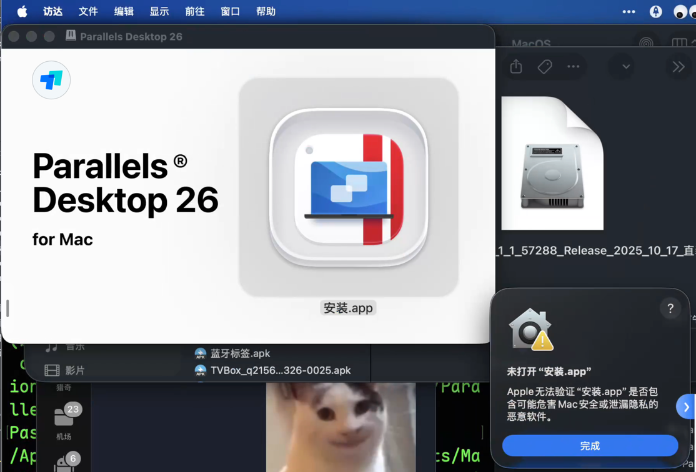

# Parallels Desktop

## Parallels Desktopp 26 激活必读 {#parallels-desktop-19_1_0}

<link-summary>Parallels Desktopp 26.x 激活必读</link-summary>

> 当前支持 PD 26 Intel/Arm64 双架构最新版本。
> {style="warning"}

未来所有ParallelsDesktop将仅分发完整的dmg文件。
用户只需要直接下载破解好的dmg直接安装即为激活版，无需手动注入。

### 须知

1. 当前支持 PD 26 Intel/Arm64 双架构最新版本
2. 破解后无明显问题，使用体验等于正版。
3. 键盘失灵？关了游戏模式优化！或者重启Mac就行了，这是PD官方问题别问我！
4. 关注 Telegram @qiuchenlymac 频道获取最新一手信息！


### 使用方法 

从QiuChenly频道下载最新的PD破解包。如果搜索不到 搜索 #PD 下载最新发布的dmg文件即可。

本文档并不一定实时更新, 以频道发布的相关通知为准。

相对于官方dmg，优化了以下内容:
  1. 安装时不再强制检查是否有更新的版本。
  2. 不再显示用户许可协议。我是盗版，我不需要遵守他的协议。
  3. 直装即为已破解版。

使用须知:
ARM运行安装后提示无法验证开发者，这是macOS安全机制导致的。
解决办法很简单，先点击取消。
1. 打开设置
2. 隐私与安全性-安全性-已阻止-点击“仍要打开”
3. 再次点击安装即可显示新窗口，点击“打开”按钮即可。

注意，如果App显示无法打开，先推出dmg镜像，然后对dmg文件进行xattr -cr xxx.dmg 再挂载即可正常。
如果仍然存在问题，直接对dmg文件进行签名即可。


### 问题说明
如果你安装dmg直装破解版遇到问题，请查阅本部分。

- Apple无法验证“安装.app”是否包含可能危害Mac安全或泄漏隐私的恶意软件。
    
  - 解决步骤:
  - 1. 推出dmg镜像
    
    2. 打开终端
    3. 执行命令, 复制dmg完整路径:
       <br>按住键盘上的option键, 鼠标右击文件即可显示此选项。
       
       ```bash
       xattr -cr {复制的文件完整路径}/ParallelsDesktop_26_1_1_57288_Release_2025_10_17_直装破解版.dmg
       codesign -fs - {复制的文件完整路径}/ParallelsDesktop_26_1_1_57288_Release_2025_10_17_直装破解版.dmg
       ```
       结果如图所示:
       
    4. 重新打开dmg文件, 开始安装即可正常。
    

#### 注意事项
- 优先选择QiuChenly官方频道发布的dmg、tar.gz、zip包
- 请勿随意相信下载安装第三方来源的不明重打包资源
